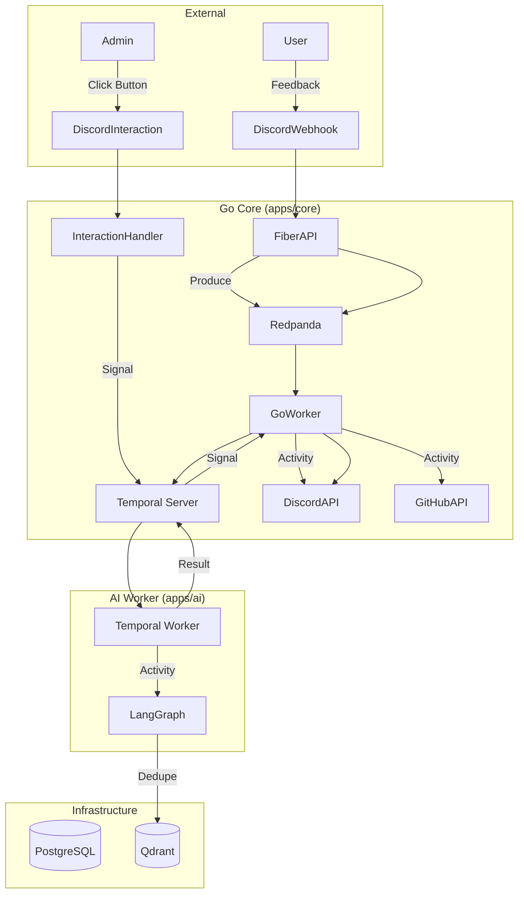

# IterateSwarm

<div align="center">


**Polyglot ChatOps Platform for AI-Powered Feedback Triage**

Turn unstructured Discord/Slack feedback into GitHub Issues using a Polyglot Temporal architecture (Go + Python).

[Features](#features) • [Architecture](#architecture) • [Tech Stack](#tech-stack) • [Setup Guide](#setup-guide) • [Progress](#progress-status)

</div>

---

## Overview

IterateSwarm is a production-grade Polyglot ChatOps platform:

- **Go Core** - High-performance webhook ingestion and Discord/GitHub integration
- **Python AI Worker** - LangGraph agents for classification and spec generation
- **Temporal** - Fault-tolerant workflow orchestration spanning both languages
- **ChatOps** - No dashboard, just Discord interactions with [Approve]/[Reject] buttons

---

## Features

- **Universal Ingestion** - Webhook support for Discord and Slack
- **Semantic Deduplication** - Qdrant vector similarity to merge duplicate feedback
- **Agentic Triaging** - LangGraph agents classify (Bug/Feature/Question) and score severity
- **Spec Generation** - AI-powered structured GitHub Issue drafting
- **ChatOps** - Discord Block Kit buttons for human-in-the-loop approval
- **Full Observability** - Temporal UI for workflow tracing

---

## Architecture



### Polyglot Pattern

| Component | Language | Task Queue | Responsibility |
|-----------|----------|------------|----------------|
| **Workflow Definition** | Go | - | Orchestration logic |
| **AI Activity** | Python | AI_TASK_QUEUE | LangGraph agents |
| **API Activity** | Go | MAIN_TASK_QUEUE | Discord, GitHub |

---

## Tech Stack

### Go Core

| Technology | Purpose |
|------------|---------|
| Fiber | HTTP framework |
| Temporal Go SDK | Workflow orchestration |
| franz-go | Redpanda/Kafka client |
| discord.go | Discord API |

### Python AI Worker

| Technology | Purpose |
|------------|---------|
| Temporal Python SDK | Activity worker |
| LangGraph | Agent orchestration |
| OpenAI SDK | Ollama (OpenAI-compatible) |
| Qdrant Client | Vector similarity search |

### Infrastructure

| Technology | Purpose |
|------------|---------|
| Temporal Server | Workflow state machine |
| Redpanda | Kafka-compatible event bus |
| PostgreSQL | Primary database |
| Qdrant | Vector database |

---

## Project Structure

```
iterate_swarm/
├── apps/
│   ├── core/              # Go service
│   │   ├── main.go        # Fiber HTTP server
│   │   ├── workflow.go    # Temporal workflow definition
│   │   ├── activities/    # Go activities (Discord, GitHub)
│   │   └── consumer.go    # Redpanda consumer
│   │
│   └── ai/                # Python service (COMPLETED)
│       ├── src/
│       │   ├── worker.py  # Temporal worker
│       │   ├── agents/    # LangGraph agents
│       │   ├── activities/# Temporal activities
│       │   └── services/  # Qdrant, etc.
│       └── tests/         # 17 tests passing
│
├── scripts/
│   └── check-infra.sh     # Infrastructure health check
├── docker-compose.yml     # Local dev stack
├── config.yaml           # App configuration
└── prd.md               # Master plan
```

---

## Progress Status

### Implementation Status

| Component | Status | Notes |
|-----------|--------|-------|
| **Docker Infrastructure** | ✅ Complete | Temporal, Redpanda, PostgreSQL, Qdrant |
| **AI Worker (Python)** | ✅ Complete | LangGraph agents, Qdrant, Temporal worker |
| **Go Core** | 🔄 In Progress | Fiber API, workflow, activities |
| **Test Suite** | ✅ Complete | 17 tests passing |

### Development Phases

| Phase | Status | Description |
|-------|--------|-------------|
| Phase 1: Infrastructure | ✅ Complete | Docker Compose, health checks |
| Phase 2: Go Core | 🔄 In Progress | Fiber webhooks, Temporal workflow |
| Phase 3: AI Worker | ✅ Complete | Temporal worker, LangGraph agents |
| Phase 4: Integration | ⏳ Pending | Go + Python workflow, Discord/GitHub |
| Phase 5: Production | ⏳ Pending | Dockerfiles, CI/CD |

---

## Setup Guide

### Prerequisites

- Docker and Docker Compose
- Go 1.21+
- Python 3.11+
- Git

### 1. Start Docker Services

Launch the infrastructure services:

```bash
cd /home/aparna/Desktop/iterate_swarm

# Start all services
docker-compose up -d

# Verify services are running
docker ps
```

**Ports:**
- Temporal: `7233`
- Redpanda: `9092` (Kafka API), `9644` (Admin)
- PostgreSQL: `5433`
- Qdrant: `6334`

### 2. Configure Environment Variables

```bash
# Copy example env file
cp .env.example .env

# Edit with your API keys
```

### 3. Set Up AI Worker

```bash
cd /home/aparna/Desktop/iterate_swarm/apps/ai

# Install dependencies with uv
uv sync

# Run tests
uv run pytest

# Start worker
uv run python -m src.worker
```

### 4. Set Up Go Core

```bash
cd /home/aparna/Desktop/iterate_swarm/apps/core

# Install dependencies
go mod tidy

# Start service
go run main.go
```

---

## Running the Application

### Development Mode

**Terminal 1 - Docker Services:**
```bash
cd /home/aparna/Desktop/iterate_swarm
docker-compose up -d
```

**Terminal 2 - AI Worker:**
```bash
cd /home/aparna/Desktop/iterate_swarm/apps/ai
uv run python -m src.worker
```

**Terminal 3 - Go Core:**
```bash
cd /home/aparna/Desktop/iterate_swarm/apps/core
go run main.go
```

### Testing

```bash
# AI Worker tests
cd /home/aparna/Desktop/iterate_swarm/apps/ai
uv run pytest

# Go tests
cd /home/aparna/Desktop/iterate_swarm/apps/core
go test ./...
```

---

## API Endpoints

### Go Core (Fiber)

| Method | Endpoint | Description |
|--------|----------|-------------|
| POST | `/webhooks/ingest` | Receive feedback -> Push to Redpanda |
| POST | `/webhooks/interaction` | Discord button clicks -> Signal workflow |
| GET | `/health` | Health check |

---

## Contributing

1. Fork the repository
2. Create a feature branch (`git checkout -b feature/your-feature`)
3. Commit your changes (`git commit -m 'feat: add your feature'`)
4. Push to the branch (`git push origin feature/your-feature`)
5. Open a Pull Request

---

## License

This project is licensed under the MIT License - see the [LICENSE](LICENSE) file for details.

---

## Acknowledgments

- [Temporal](https://temporal.io) for workflow orchestration
- [LangGraph](https://langchain-ai.github.io/langgraph) for agent orchestration
- [Redpanda](https://redpanda.com) for high-performance streaming
- [Qdrant](https://qdrant.tech) for vector similarity search

---

<div align="center">
Built with precision by IterateSwarm
</div>