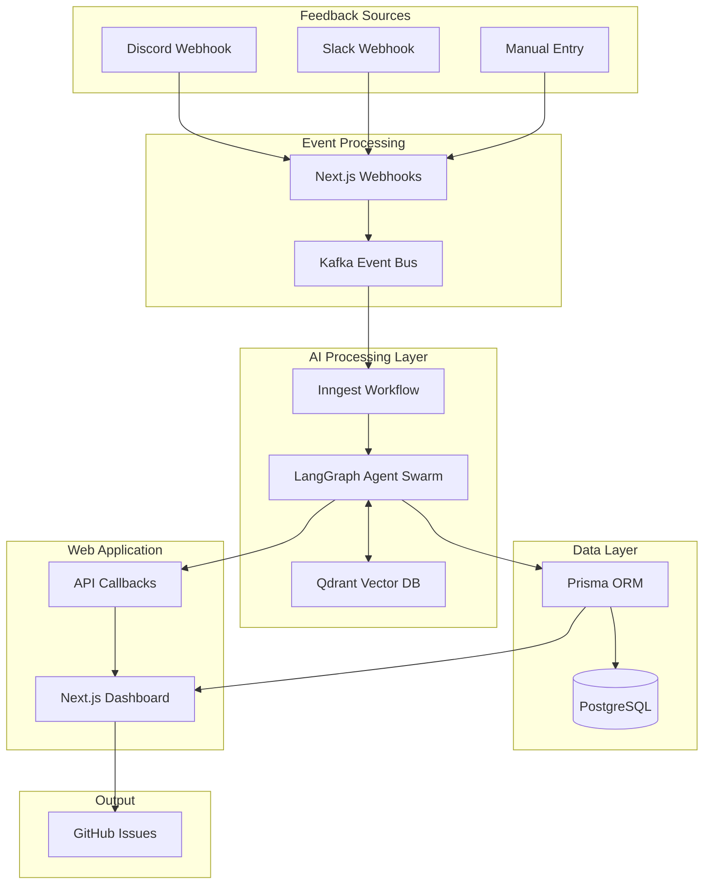

# IterateSwarm

<div align="center">


**AI-Powered Feedback Triage System for GitHub Issue Management**

An event-driven autonomous agent swarm that turns unstructured user feedback from Discord and Slack into production-ready GitHub Issues.

[Features](#features) • [Architecture](#architecture) • [Tech Stack](#tech-stack) • [Setup Guide](#setup-guide) • [Progress](#progress-status)

</div>

---

## Overview

IterateSwarm is a modern, production-grade system designed for technical founders and development teams who need to efficiently process user feedback from multiple channels. The system automatically:

- Ingests feedback from Discord, Slack, and manual entry via webhooks
- Uses semantic vector search to detect and merge duplicate feedback
- Employs autonomous AI agents to classify, triage, and prioritize issues
- Generates structured GitHub issue drafts with severity scores and reproduction steps
- Provides a human-in-the-loop dashboard for review before publishing

---

## Features

- **Universal Ingestion** - Webhook support for Discord, Slack, and manual feedback entry
- **Semantic Deduplication** - Uses Qdrant vector similarity to merge duplicate feedback (e.g., "Login broken" and "Can't sign in" become one issue)
- **Agentic Triaging** - Autonomous classification (Bug/Feature/Question) and severity scoring
- **Spec Generation** - AI-powered structured GitHub Issue drafting with title, reproduction steps, and affected components
- **Human-in-the-Loop (HITL)** - Dashboard for founders to approve/reject agent drafts before GitHub publication
- **Full Observability** - End-to-end tracing of agent decision-making process via Langfuse

---

## Architecture



### Data Flow

1. **Ingestion** - User feedback arrives via Discord/Slack webhooks to Next.js API
2. **Queueing** - Feedback is published to Kafka for reliable event processing
3. **Orchestration** - Inngest triggers the agent workflow
4. **AI Processing** - LangGraph agents analyze, deduplicate, and classify feedback
5. **Storage** - Draft issues are persisted to PostgreSQL via Prisma
6. **Review** - Dashboard displays drafts for human approval
7. **Publishing** - Approved issues are created as GitHub issues

---

## Tech Stack

### Frontend

| Technology | Purpose |
|------------|---------|
| [Next.js 16](https://nextjs.org) | React framework with App Router |
| [React 19](https://react.dev) | UI library |
| [Shadcn/UI](https://ui.shadcn.com) | Component library |
| [Tailwind CSS](https://tailwindcss.com) | Utility-first CSS |
| [Prisma ORM](https://prisma.io) | Database ORM |

### Backend

| Technology | Purpose |
|------------|---------|
| [FastAPI](https://fastapi.tiangolo.com) | Python web framework |
| [Inngest](https://inngest.com) | Event-driven workflow orchestration |
| [LangGraph](https://langchain-ai.github.io/langgraph) | Agent workflow orchestration |
| [LangChain OpenAI](https://python.langchain.com) | LLM integration framework |
| [Qdrant](https://qdrant.tech) | Vector similarity search |

### Infrastructure

| Technology | Purpose |
|------------|---------|
| [PostgreSQL](https://postgresql.org) | Primary relational database |
| [Qdrant](https://qdrant.tech) | Vector similarity search |
| [Apache Kafka](https://kafka.apache.org) | Event streaming platform |
| [Docker](https://docker.com) | Container orchestration |

---

## Project Structure

```
iterate_swarm/
├── ai_service/              # FastAPI backend service
│   ├── src/
│   │   ├── agents/          # LangGraph agent implementations
│   │   ├── api/             # FastAPI routes and endpoints
│   │   ├── client/          # Callback clients (httpx)
│   │   ├── core/            # Configuration (pydantic-settings)
│   │   ├── inngest/         # Inngest workflow definitions
│   │   ├── schemas/         # Pydantic models
│   │   └── services/        # External service integrations (Qdrant, Kafka, GitHub)
│   ├── pyproject.toml       # Python dependencies (uv)
│   └── tests/               # Python tests (pytest)
│
├── fullstack/               # Next.js web application
│   ├── src/
│   │   ├── app/
│   │   │   ├── api/         # API routes (webhooks, issues)
│   │   │   └── page.tsx     # Dashboard UI
│   │   ├── components/      # React components
│   │   └── lib/             # Utility functions
│   ├── prisma/
│   │   └── schema.prisma    # Database schema
│   ├── package.json         # Node.js dependencies (pnpm)
│   └── e2e/                 # Playwright tests
│
├── infra/                   # Infrastructure as code
├── docker-compose.yml       # Docker services configuration
└── prd.md                   # Product requirements document
```

---

## Progress Status

### Implementation Status

| Component | Status | Notes |
|-----------|--------|-------|
| **Prisma Schema** | ✅ Complete | FeedbackItem, Issue, AuditLog models |
| **AI Service (FastAPI)** | ✅ Complete | LangGraph agents, Qdrant, httpx callbacks |
| **Webhook APIs** | ✅ Complete | Discord (Ed25519), Slack (HMAC) validation |
| **Internal Save Issue API** | ✅ Complete | Bearer token auth + Prisma transactions |
| **Issue Approval Flow** | ✅ Complete | GitHub API integration, optimistic locking |
| **Docker Infrastructure** | ⚠️ Partial | PostgreSQL + Qdrant (Kafka missing) |

### Feature Completion

- [x] Discord webhook ingestion with signature verification
- [x] Slack webhook ingestion with HMAC validation
- [x] FeedbackItem + Issue Prisma schema
- [x] Triage Agent (LangGraph) for classification
- [x] Spec Writer Agent (LangGraph) for issue drafting
- [x] Qdrant vector service for semantic deduplication
- [x] Internal callback API for saving issues
- [x] Issue approve/reject endpoints with GitHub API
- [x] Human-in-the-loop dashboard UI
- [ ] Kafka containerization (pending)
- [ ] Dashboard stats API endpoint (pending)
- [ ] Langfuse observability setup (pending)

---

## Setup Guide

### Prerequisites

- Docker and Docker Compose
- Python 3.13+
- Node.js 20+ with pnpm
- Git

### 1. Start Docker Services

Launch the infrastructure services (PostgreSQL and Qdrant):

```bash
# Navigate to project root
cd /home/aparna/Desktop/iterate_swarm

# Start PostgreSQL and Qdrant containers
docker-compose up -d

# Verify services are running
docker ps
```

**Ports:**
- PostgreSQL: `5433` (default 5432 remapped)
- Qdrant: `6334` (default 6333 remapped)

### 2. Configure Environment Variables

#### AI Service

```bash
cd /home/aparna/Desktop/iterate_swarm/ai_service

# Copy example env file
cp .env.example .env

# Edit with your API keys
```

#### Web Application

```bash
cd /home/aparna/Desktop/iterate_swarm/fullstack

# Copy example env file
cp .env.example .env

# Edit with your configuration
```

### 3. Set Up AI Service

```bash
cd /home/aparna/Desktop/iterate_swarm/ai_service

# Install dependencies with uv
uv sync

# Run tests
uv run pytest

# Start development server
uv run fastapi dev

# Service will be available at http://localhost:8000
# API docs at http://localhost:8000/docs
```

### 4. Set Up Web Application

```bash
cd /home/aparna/Desktop/iterate_swarm/fullstack

# Install dependencies with pnpm
pnpm install

# Generate Prisma client
pnpm postinstall

# Run database migrations
pnpm db:migrate

# Start development server
pnpm dev

# Application will be available at http://localhost:3000
```

---

## Running the Application

### Development Mode

**Terminal 1 - AI Service:**
```bash
cd /home/aparna/Desktop/iterate_swarm/ai_service
uv run fastapi dev
```

**Terminal 2 - Web Application:**
```bash
cd /home/aparna/Desktop/iterate_swarm/fullstack
pnpm dev
```

**Terminal 3 - Docker Services (if not running):**
```bash
cd /home/aparna/Desktop/iterate_swarm
docker-compose up -d
```

### Testing

```bash
# AI Service tests
cd /home/aparna/Desktop/iterate_swarm/ai_service
uv run pytest

# Web Application E2E tests
cd /home/aparna/Desktop/iterate_swarm/fullstack
pnpm exec playwright test
```

---

## API Endpoints

### Webhooks

| Method | Endpoint | Description |
|--------|----------|-------------|
| POST | `/api/webhooks/discord` | Receive feedback from Discord (Ed25519 signed) |
| POST | `/api/webhooks/slack` | Receive feedback from Slack (HMAC signed) |

### Internal API

| Method | Endpoint | Description |
|--------|----------|-------------|
| POST | `/api/internal/save-issue` | Save AI-generated issue draft |

### Issues

| Method | Endpoint | Description |
|--------|----------|-------------|
| GET | `/api/issues` | List all issues |
| POST | `/api/issues/{id}/approve` | Approve and publish to GitHub |
| POST | `/api/issues/{id}/reject` | Reject issue draft |

---

## Contributing

1. Fork the repository
2. Create a feature branch (`git checkout -b feature/your-feature`)
3. Commit your changes (`git commit -m 'feat: add your feature'`)
4. Push to the branch (`git push origin feature/your-feature`)
5. Open a Pull Request

---

## License

This project is licensed under the MIT License - see the [LICENSE](LICENSE) file for details.

---

## Acknowledgments

- [LangGraph](https://langchain-ai.github.io/langgraph) for the agent orchestration framework
- [Inngest](https://inngest.com) for event-driven workflow capabilities
- [Shadcn/UI](https://ui.shadcn.com) for the beautiful component library
- [Qdrant](https://qdrant.tech) for vector similarity search

---

<div align="center">
Built with precision by IterateSwarm
</div>
