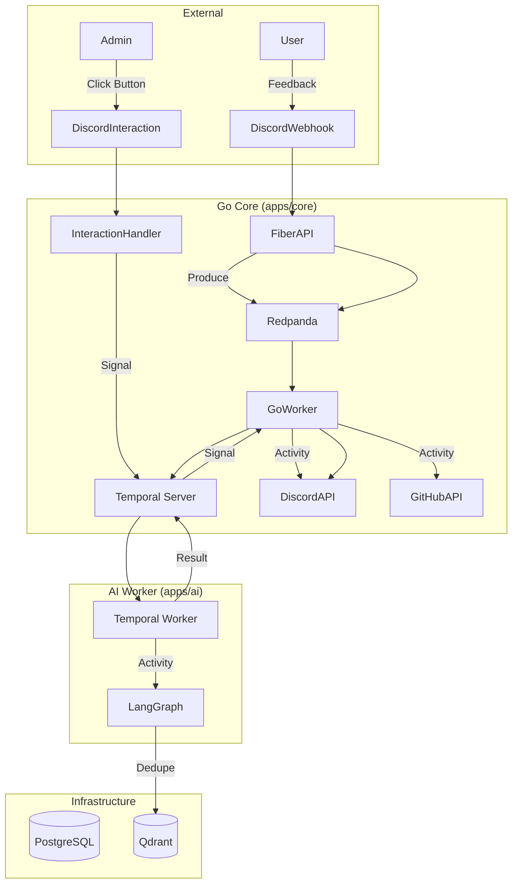

# IterateSwarm Master Plan (ChatOps Pivot)

This is the **Master Plan** for **IterateSwarm** - A Polyglot ChatOps Platform.

***

# **1. Product Requirements Document (PRD)**

**Product Name:** IterateSwarm
**One-Liner:** An event-driven autonomous agent swarm that turns unstructured user feedback into production-ready GitHub Issues via Discord/Slack.
**Architecture:** ChatOps - No dashboard, just Discord interactions.

### **Core Features (MVP)**
1.  **Universal Ingestion:** Webhooks for Discord/Slack.
2.  **Semantic Deduplication:** Qdrant vector search to merge duplicate feedback.
3.  **Agentic Triaging:** LangGraph agents classify (Bug/Feature/Question) and score severity.
4.  **Spec Generation:** Agent drafts a structured GitHub Issue.
5.  **Human-in-the-Loop (ChatOps):** Discord message with [Approve]/[Reject] buttons.
6.  **Full Observability:** Temporal UI for workflow tracing.

***

# **2. System Architecture (Polyglot Temporal)**

### **The Tech Stack**

| Component | Tech Choice | Purpose |
|-----------|-------------|---------|
| **Ingestion API** | Go + Fiber | High-performance webhook receiver |
| **Orchestration** | Temporal | Workflow state machine |
| **AI Worker** | Python + LangGraph | LLM processing (Ollama/qwen2.5-coder) |
| **Vector DB** | Qdrant | Semantic duplicate detection |
| **Event Bus** | Redpanda | Kafka-compatible message buffer |
| **Primary DB** | PostgreSQL | App data persistence |
| **Interface** | Discord | ChatOps (Block Kit buttons) |

### **High-Level Data Flow**



### **Polyglot Workflow Pattern**

1.  **Workflow Definition (Go):** The "Manager" - defines steps, waits for signals.
2.  **Activity A (Python):** The "Specialist" - AI processing (LangGraph agents).
3.  **Activity B (Go):** The "Generalist" - Discord/GitHub API calls.

**Task Queues:**
- `AI_TASK_QUEUE`: Python worker for AI activities
- `MAIN_TASK_QUEUE`: Go worker for API activities

***

# **3. Data Models**

### **Workflow State (Temporal)**

```python
class FeedbackInput(TypedDict):
    feedback_id: str
    content: str
    source: str  # discord, slack

class IssueSpec(TypedDict):
    title: str
    classification: str  # bug, feature, question
    severity: str  # low, medium, high, critical
    reasoning: str
    reproduction_steps: list[str]
    affected_components: list[str]
    acceptance_criteria: list[str]
    suggested_labels: list[str]
    confidence: float
```

### **PostgreSQL (App Data)**

```sql
CREATE TABLE feedback (
    id UUID PRIMARY KEY,
    content TEXT,
    source VARCHAR(50),
    status VARCHAR(20),  -- pending, approved, rejected
    issue_url TEXT,
    created_at TIMESTAMP DEFAULT NOW()
);
```

***

# **4. Project Structure**

```
iterate_swarm/
├── apps/
│   ├── core/              # Go service
│   │   ├── main.go        # Fiber HTTP server
│   │   ├── workflow.go    # Temporal workflow definition
│   │   ├── activities/    # Go activities (Discord, GitHub)
│   │   └── consumer.go    # Redpanda consumer
│   └── ai/                # Python service
│       ├── src/
│       │   ├── worker.py  # Temporal worker
│       │   ├── agents/    # LangGraph agents
│       │   ├── activities/# Temporal activities
│       │   └── services/  # Qdrant, etc.
│       └── tests/
├── infra/                 # Docker configs
├── docker-compose.yml     # Local dev stack
├── config.yaml           # App configuration
└── prd.md               # This document
```

***

# **5. Development Phases**

## **Phase 1: Infrastructure (COMPLETED)**
- [x] Docker Compose: Redpanda, Temporal, PostgreSQL, Qdrant
- [x] Health check scripts

## **Phase 2: Go Core (NEXT)**
- [ ] Fiber HTTP server for webhooks
- [ ] Temporal workflow definition
- [ ] Go activities (Discord, GitHub)
- [ ] Redpanda consumer

## **Phase 3: AI Worker (COMPLETED)**
- [x] Python Temporal worker
- [x] LangGraph triage agent
- [x] LangGraph spec writer agent
- [x] Qdrant vector service
- [x] Test suite (17 tests passing)

## **Phase 4: Integration**
- [ ] Connect Go workflow to Python activities
- [ ] Discord Block Kit integration
- [ ] GitHub API integration
- [ ] End-to-end test

## **Phase 5: Production**
- [ ] Dockerfiles for both services
- [ ] CI/CD pipeline
- [ ] Deployment scripts

***

# **6. API Endpoints**

### **Go Core (Fiber)**

| Method | Endpoint | Description |
|--------|----------|-------------|
| POST | `/webhooks/ingest` | Receive feedback -> Push to Redpanda |
| POST | `/webhooks/interaction` | Discord button clicks -> Signal workflow |
| GET | `/health` | Health check |

### **Temporal Workflow**

**Workflow:** `FeedbackLifecycle`

1. Activity `AnalyzeFeedback` (Python) - AI processing
2. Activity `SendApprovalRequest` (Go) - Discord buttons
3. Signal `UserAction` - Wait for admin decision
4. Activity `PublishToGitHub` (Go) - Create issue (if approved)

***

# **7. Configuration**

```yaml
temporal:
  host: "localhost"
  port: 7233
  task_queue: "AI_TASK_QUEUE"

ollama:
  base_url: "http://localhost:11434/v1"
  model: "qwen2.5-coder:3b"
  embedding_model: "nomic-embed-text"

qdrant:
  url: "http://localhost:6333"
  collection: "feedback_items"
  similarity_threshold: 0.85

discord:
  bot_token: "${DISCORD_BOT_TOKEN}"
  admin_channel_id: "${DISCORD_ADMIN_CHANNEL}"

github:
  token: "${GITHUB_TOKEN}"
  owner: "${GITHUB_OWNER}"
  repo: "${GITHUB_REPO}"
```

***

# **8. Testing Strategy**

### **Unit Tests**
- Python: pytest (17 tests passing)
- Go: testing package

### **Integration Tests**
- Temporal worker connectivity
- Qdrant duplicate detection
- Full workflow execution

### **E2E Tests**
- Webhook -> Workflow -> Discord -> Approval -> GitHub

***

Last Updated: 2026-02-02
